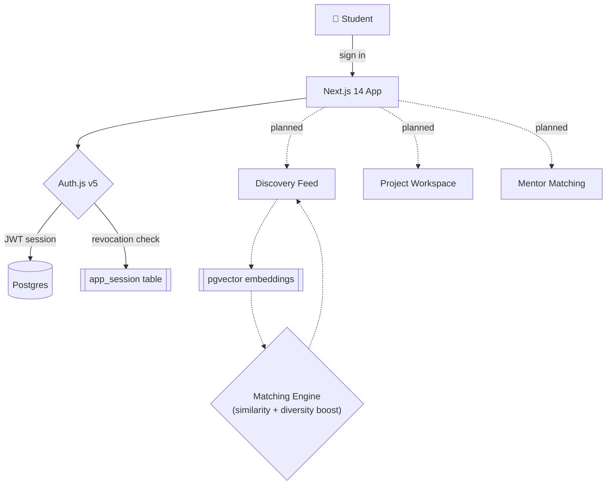

<div align="center">


<a href="https://readme-typing-svg.demolab.com">
  
</a>

<br/>

[](#roadmap--levels)
[](https://nextjs.org)
[](https://www.figma.com/design/TIxkBM5aVrIXGgcGsaQJkD)
[](#license)

</div>

A collaboration platform connecting student builders across universities — find teammates, mentors, and projects, no matter which campus you're on.

---

##  Screenshots & demo

<div align="center">

<table>
<tr>
<td align="center"><br/><sub>Discovery feed — <b>coming soon</b></sub></td>
<td align="center"><br/><sub>Sign up / sign in — <b>coming soon</b></sub></td>
</tr>
<tr>
<td align="center"><br/><sub>Workspace — <b>coming soon</b></sub></td>
<td align="center"><br/><sub>Mentorship — <b>coming soon</b></sub></td>
</tr>
</table>

*Click-through prototype available today → [`synapse_prototype.html`](synapse_prototype.html) (25 screens). Swap the tiles above for real captures once you export them.*

</div>

---

##  The problem

Talented student researchers are sorted by which campus they happen to attend, not by what they can do. A student building something ambitious at a smaller or less-resourced school has no reliable way to find collaborators, mentors, or opportunities outside their own hallway — while the same student at a handful of elite institutions has that network handed to them by default.

Linked exists to close that gap: a verified, cross-campus network built specifically for student researchers, piloting first at Grambling State University and expanding across HBCUs before going national.

---

##  Getting started

The working piece of the product today is the auth layer in [`linked-auth/`](linked-auth), running against a real Postgres database rather than mocked up.

```
# Clone
git clone https://github.com/<your-username>/linked.git
cd linked/linked-auth

# Install
npm install

# Configure
cp .env.example .env.local   # add your Postgres + OAuth credentials

# Run
npm run dev
```

> [!TIP]
> Want the full click-through experience with zero setup? Open [`synapse_prototype.html`](synapse_prototype.html) straight in a browser.

---

##  What's built

| Deliverable | What it is |
| --- | --- |
| [`synapse_prototype.html`](synapse_prototype.html) | 25-screen interactive HTML prototype — the full app, click-through |
| [`synapse_blueprint.html`](synapse_blueprint.html) | Product blueprint — concept, features, AI layer, roadmap, revenue |
| [`synapse_sitemap.html`](synapse_sitemap.html) | 46-screen sitemap across MVP, V2, and V3 phases |
| [`synapse_project_document.docx`](synapse_project_document.docx) | Full project document — architecture, tech stack, algorithms, data model |
| [Figma — Linked prototype](https://www.figma.com/design/TIxkBM5aVrIXGgcGsaQJkD) | High-fidelity mobile screens: auth sequence, onboarding, home feed |
| [`linked-auth/`](linked-auth) | Working code — sign up, sign in, forgot password, OAuth, sessions |

The prototype and Figma files are the source of truth for design.

---

##  Core features

- **🔍 Discover** — an AI-matched feed of projects, teammates, and mentors, weighted toward merit over proximity, using embedding similarity plus a diversity boost that corrects for the filter-bubble effect a pure-similarity recommender would create
- **✅ Verify** — a Student Verified badge tied to `.edu` confirmation, so trust doesn't depend on who you already know
- **🛠️ Build** — a full project workspace (tasks, chat, files, milestones) once a team forms
- **📈 Grow** — a living portfolio that fills itself in as the work happens, instead of a resume assembled after the fact

---

##  Architecture

*High-level, in-progress. Solid arrows are shipped; dashed arrows are planned.*



---

## Tech stack

Next.js 14 + TypeScript, Auth.js, Postgres with `pgvector` for matching, Tailwind CSS.

---

##  Roadmap — levels

Think of the roadmap as levels in a game. Update the bars as each one clears.

**🟦 Level 1 — Grambling Pilot**

Target: 100 verified students, 15 projects.

**🟧 Level 2 — HBCU Network** `🔒 locked`


**⬜ Level 3 — National** `🔒 locked`


---

##  Security & privacy

What's actually implemented in [`linked-auth/`](linked-auth) today:

- **Password storage** — Argon2id hashing (not a reversible or fast hash)
- **Brute-force protection** — rate limiting at 3 failed sign-in attempts per hour
- **OAuth** — Google and GitHub sign-in supported alongside email/password
- **Forgot password** — 6-digit code, SHA-256 hashed at rest, 15-minute expiry, HMAC-signed reset token
- **Session revocation** — a custom `app_session` table backs JWT sessions so a revoked session is actually rejected, not just ignored client-side
- **Password reset** — invalidates every existing session, everywhere, immediately

> [!IMPORTANT]
> No `SECURITY.md` or responsible-disclosure process yet — **TBD**. Until then, flag anything sensitive privately rather than in a public issue.

---

##  FAQ

<details>
<summary><b>What is Linked?</b></summary><br/>
A cross-campus research collaboration platform for student researchers — think LinkedIn + GitHub + ResearchGate + Slack, but built for finding a team, not a job.
</details>

<details>
<summary><b>Can I sign up right now?</b></summary><br/>
Not yet — it's in active prototype/pilot-build phase, starting at Grambling State University.
</details>

<details>
<summary><b>What stops matching from just favoring students who already have connections?</b></summary><br/>
The matching algorithm applies a diversity boost on top of embedding similarity, specifically to correct the filter-bubble effect a pure-similarity recommender would otherwise create.
</details>

<details>
<summary><b>Is there a mobile app?</b></summary><br/>
Not yet — the product is web-first, though the Figma prototype is designed mobile-first.
</details>

<details>
<summary><b>Who's building this, and why?</b></summary><br/>
Jonathan Moonga, an Engineering Technology junior at Grambling State University, building it around fairness, access, and connection across borders.
</details>

---

##  Team

<div align="center">

| | |
| :---: | --- |
| 🧑‍💻 | **Jonathan Moonga** — Founder, everything (concept → design → code) |
| 🎨 | **Design** — *open, TBD* |
| ⚙️ | **Backend** — *open, TBD* |
| 📱 | **Mobile** — *open, TBD* |

</div>

---

## Documentation

For architecture, the data model, and the full algorithm rationale, [**head over to the project document**](synapse_project_document.docx).

## Contributing

Linked isn't open for outside contributions yet — it's a solo build in active development. If you'd like to follow along or get involved early (as a pilot user, designer, or engineer), reach out — see Community below.

##  Support & community

- 🐛 Bugs & ideas → [GitHub Issues](../../issues)
- 💬 Discord / chat → **coming soon**
- 📧 Direct contact → **TBD**

##  Changelog

**Unreleased**
- Renamed the product from *Synapse* to **Linked**
- `linked-auth`: Next.js 14 + Auth.js v5 auth system verified end-to-end (sign up, sign in, OAuth, forgot password, session revocation)
- Fixed two Auth.js v5 issues — Credentials-provider JWT sessions forced regardless of config, and stale/revoked sessions reconstructed from raw JWT claims
- Built the 25-screen HTML prototype
- Extended the "Linked prototype" Figma file with 6 new auth screens and 13 click-to-navigate reactions
- Wrote the 15-page project document (architecture, algorithms, data model, roadmap)

##  Values

- **Merit over proximity** — the reason this exists
- **Verified, not vouched-for** — trust comes from `.edu` confirmation, not who you know
- **Small schools first** — a deliberate starting constraint, not a footnote
- **Mentorship is infrastructure** — not an occasional nice thing that happens

> [!NOTE]
> If you're building something related to Linked and using its name, please note in your README that it isn't built by or affiliated with this project.

## License

MIT

---

<div align="center">

**Built by** [Jonathan Moonga](#) · Computer Science, Software Engineering & Product


</div>
